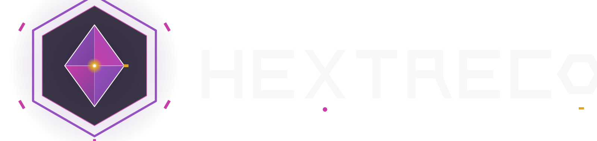

  

# hextreco

Backstage IDP da Insight Valley — laboratório aberto.

## Identidade visual

O símbolo é um hexágono com gema facetada e uma faísca quente no
núcleo. Vocabulário Hextech por fora, piscadela de ferramenta de
oficina por dentro. Paleta, variantes e racional ficam em
[`assets/brand/BRAND.md`](./assets/brand/BRAND.md). Cores herdadas da
Insight Valley mãe — sem tokens novos, sem ciano, mesmo com a
referência a Hextech.
